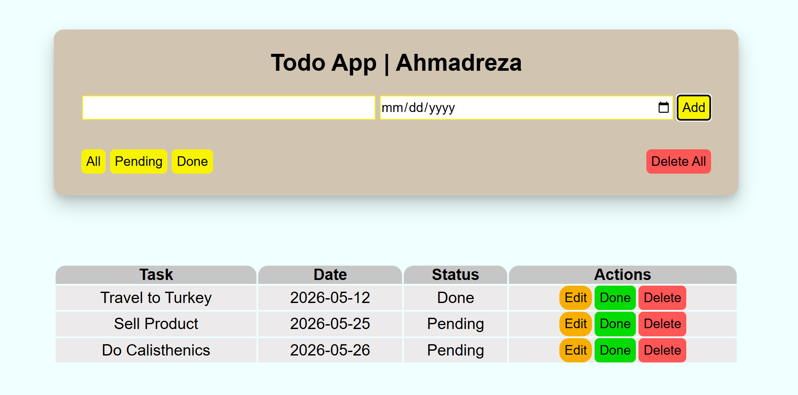

📝 Todo App
A simple and clean Todo application that helps users manage daily tasks. Users can add, complete, and delete tasks easily.

🚀 Live Demo
https://atalan04.github.io/TO-DO-APP/

📸 Preview

🛠 Technologies Used
HTML5
CSS3
JavaScript (ES6)
LocalStorage

✨ Features
Add new tasks
Mark tasks as completed
Delete tasks
Data persistence using LocalStorage
Responsive design

🧠 What I Learned
Manipulating the DOM using JavaScript
Handling user input and events
Saving and retrieving data from LocalStorage
Structuring a small frontend project

⚙️ How to Run Locally
Clone the repository
Open index.html in your browser

git clone https://github.com/username/todo-app.git

📌 Future Improvements
Edit existing tasks
Add task categories
Dark mode

👨‍💻 Author
GitHub: https://github.com/Atalan04/TO-DO-APP.git

  

